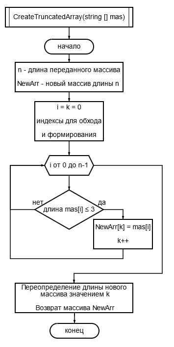

# Контрольная работа

## Задание итоговой работы

## Блок-схема алгоритма формирования массива 

## Код метода алгоритма
---
    string [] CreateTruncatedArray(string [] mas)
    {
        int n = mas.Length;
        string [] NewArr = new string[n];
        int k = 0;
        for(int i=0; i < n; i++)
            if(mas[i].Length <=3)
                NewArr[k++] = mas[i];
        System.Array.Resize(ref NewArr, k);
        return NewArr;        
    }
---

## Пояснения работы алгоритма
Функция **CreateTruncatedArray** принимает на вход исходный массив строк и формирует по нему результирующий массив согласно условию задания. 

Для этого вначале создаётся новый строковый массив *NewArr* длиной, первоначально равной длине исходного массива. 

Проходя в цикле по всем элементам исходного массива, отбираем те элементы, чьи длины не превосходят 3, и записываем их в результирующий массив. Индекс-позицию текущего подходящего под условие элемента исходного массива в результирующем массиве ведём вручную (значение переменной *k*).

После обработки исходного массива в переменной *k* содержится реальная длина нового массива. Используя встроенный метод изменения длины одномерного массива, устанавливаем массиву *NewArr* фактическую длину и возвращаем его результатом работы функции.

В программе останется завести исходный массив строк, на его основе с помощью описанной функции сформировать необходимый массив и отобразить результаты на экране.

